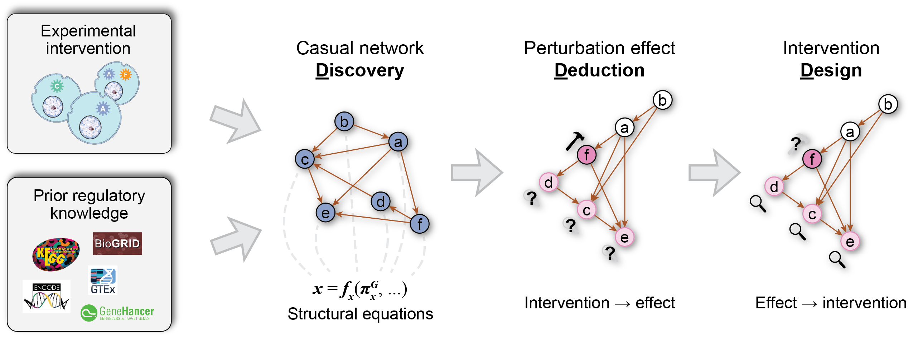

# Causal discovery of gene regulatory programs from single-cell genomics

[](https://github.com/gao-lab/CASCADE/actions/workflows/build.yml)
[](https://codecov.io/gh/gao-lab/CASCADE)
[](https://opensource.org/licenses/MIT)
[](https://github.com/python/black)

**CASCADE** stands for **C**ausality-**A**ware **S**ingle-**C**ell **A**daptive
**D**iscover/**D**eduction/**D**esign **E**ngine. It is a deep learning-based
bioinformatics tool for causal gene regulatory network discovery, counterfactual
perturbation effect prediction, and targeted intervention design based on
high-content single-cell perturbation screens.

Trained on single-cell perturbation data, CASCADE models the causal gene
regulatory network as a directed acyclic graph (DAG) and leverages
differentiable causal discovery (DCD) to transform the search of discrete
network structures into a manageable optimization problem. We achieve causal
discovery with thousands of genes by incorporating a scaffold graph built from
context-agnostic, coarse prior regulatory knowledge to constrain search space
and enhance computational efficiency in an evidence-guided manner. Additionally,
technical confounding covariate as well as gene-wise perturbation latent
variables encoded from gene ontology (GO) annotations are also included to
account for effects not explained by the causal structure. The complete CASCADE
model is constructed within a Bayesian framework, allowing for the estimation of
causal uncertainty under limited data regimes typical of practical biological
experiments.



Using the inferred causal regulatory network, CASCADE supports two types of
downstream inference. First, it performs counterfactual deduction of unseen
perturbation effects by iteratively propagating perturbation effects following
the topological order of the causal graph. Notably, this deduction process
remains end-to-end differentiable, allowing it to be inverted into intervention
design by treating gene intervention as an optimizable parameter trained to
minimize deviation between the counterfactual outcome and desired target
transcriptomes.

For more details, please check out our preprint at TODO.

## Install

CASCADE is implemented in the ``cascade-reg`` package. It can be installed
directly using pip:

```sh
pip install cascade-reg
```

To avoid potential dependency conflicts, installing within a
[conda environment](https://conda.io/projects/conda/en/latest/user-guide/tasks/manage-environments.html)
is recommended.

A conda build will be available in the future.

## How to use

Proceed to our [documentation site](https://cascade-reg.readthedocs.io) for how to
use the ``cascade-reg`` package.

## Replicate results

1. Check out the repository to branch `repicate`:
   ```sh
   git checkout replicate
   ```
2. Create a local conda environment using the `env.sh` script:
   ```sh
   ./env.sh create
   ```
3. Activate the local conda environment:
   ```sh
   mamba activate ./conda
   ```
4. Use scripts in `data/download` to prepare necessary data
5. Use scripts in `data/scaffold` to prepare the scaffold graphs
6. Use pipeline in `evaluation` for running systematic benchmarks
7. Use notebooks in `experiments` for intervention design case studies

## Development

Instructions below are only for development purpose.

### Environment setup

Use the following commands to manage the development environment:

```sh
./env.sh create  # Create new environment based on config files
./env.sh export  # Export environment changes to config files
./env.sh update  # Update environment based on config files
```

Use the following commands to activate and deactivate the environment:

```sh
mamba activate ./conda
mamba deactivate
```

### Build documentation

```sh
sphinx-build -b html -D language=en docs docs/_build/html/en
```
