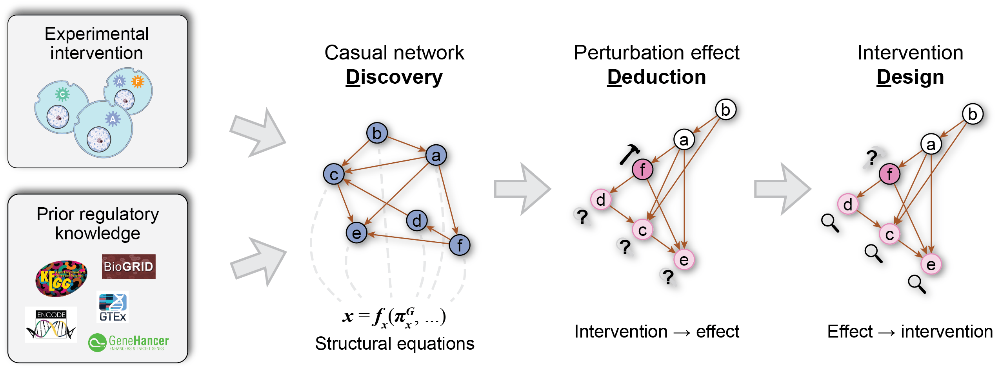

CASCADE documentation
=====================

**CASCADE** stands for **C**\ ausality-**A**\ ware **S**\ ingle-**C**\ ell
**A**\ daptive **D**\ iscover/**D**\ eduction/**D**\ esign **E**\ ngine. It is a
deep learning-based bioinformatics tool for causal gene regulatory network
discovery, counterfactual perturbation effect prediction, and targeted
intervention design based on high-content single-cell perturbation screens.

Trained on single-cell perturbation data, CASCADE models the causal gene
regulatory network as a directed acyclic graph (DAG) and leverages
differentiable causal discovery (DCD) to transform the search of discrete
network structures into a manageable optimization problem. We achieve causal
discovery with thousands of genes by incorporating a scaffold graph built from
context-agnostic, coarse prior regulatory knowledge to constrain search space
and enhance computational efficiency in an evidence-guided manner. Additionally,
technical confounding covariate as well as gene-wise perturbation latent
variables encoded from gene ontology (GO) annotations are also included to
account for effects not explained by the causal structure. The complete CASCADE
model is constructed within a Bayesian framework, allowing for the estimation of
causal uncertainty under limited data regimes typical of practical biological
experiments.

Using the inferred causal regulatory network, CASCADE supports two types of
downstream inference. First, it performs counterfactual deduction of unseen
perturbation effects by iteratively propagating perturbation effects following
the topological order of the causal graph. Notably, this deduction process
remains end-to-end differentiable, allowing it to be inverted into intervention
design by treating gene intervention as an optimizable parameter trained to
minimize deviation between the counterfactual outcome and desired target
transcriptomes.

For more details about the CASCADE model, please check out our preprint at TODO.

.. toctree::
   :maxdepth: 2
   :caption: Contents:

   install
   tutorials
   resources
   api
   cli

Indices and tables
==================

* :ref:`genindex`
* :ref:`modindex`
